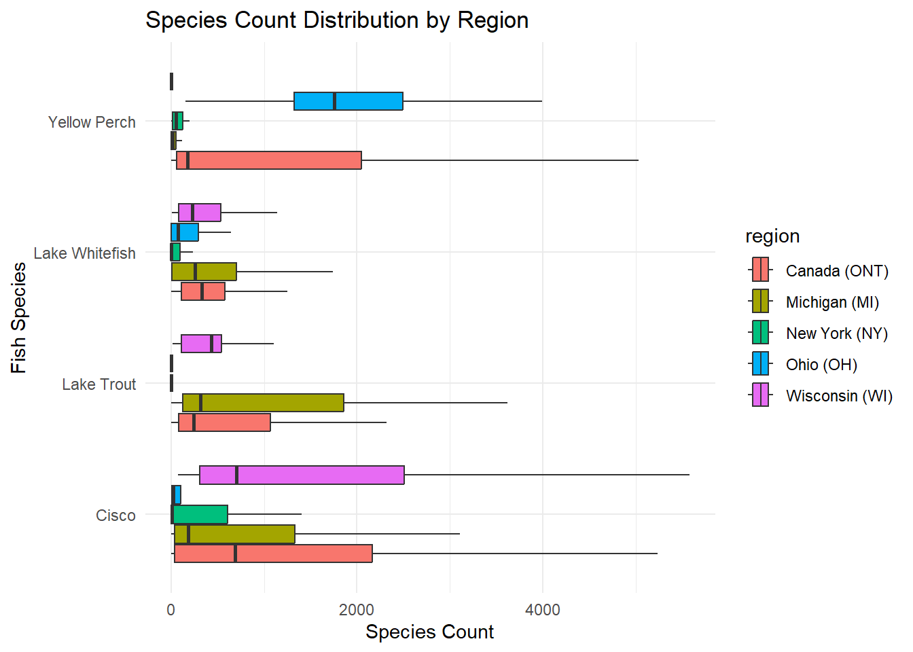

## Great Lakes Fish Analysis

### Abstract 

This analysis examines how fish species distribute across different places using data visualization techniques. The purpose of this analysis is to determine how the different species vary by region and whether particular locations have higher concentration of specific species.

### Introduction

The Great Lakes, one of the largest freshwater ecosystems in the world, have been essential to maintaining commercial fish production for more than a hundred years. The fisheries in this basin have been an important economic and ecological resource, benefiting local communities, industries, and biodiversity. An understanding of trends in fish production across different locations and species proves to be most helpful in judging the health of ecosystems, trends in populations, and sustainability in fisheries management.

This project examines historical and current commercial fish production records in the Great Lakes from 1867 to 2020. The data set, which was gathered from a number of government and tribal agencies, provides a comprehensive report of fish catches from different locations, species, and time intervals. Originally collected in 1940 by the international Board of Inquiry for the Great Lakes Fisheries, the data have been updated periodically by the Great Lakes Fisheries, the data have been updated periodically by the Great Lakes Fishery Commission and other agencies, keeping it current and accessible to researchers.

For the analysis in this study, the region of occurrence and the species of fish are the two key variables. the top Five most caught species of fish have been emphasized in this research in a comparison of their occurrence over the chosen regions of Michigan (MI), New York (NY), Ohio (OH), Wisconsin (WI), and Ontario (ONT). The aim of this study is to investigate the potential variability of fish species in Great Lakes locations and hence increase the general understanding of regional ecological diversity and species distributional patterns.

### Hypothesis

The types of species vary by region due to their unique environmental conditions.

### Gathering Data

The following code imports the tidyverse package and reads in two data sets with the read_cvs() function from readr. The fishing data set contains fishing data, while the stocked data set holds data about stocked fish. Each data set is read from a URL and imported into separate variables to be analyzed.


::: {.cell}

```{.r .cell-code}
#install.packages("tidyverse")
library(tidyverse)
```

::: {.cell-output .cell-output-stderr}

```
── Attaching core tidyverse packages ──────────────────────── tidyverse 2.0.0 ──
✔ dplyr     1.1.4     ✔ readr     2.1.5
✔ forcats   1.0.0     ✔ stringr   1.5.1
✔ ggplot2   3.5.1     ✔ tibble    3.2.1
✔ lubridate 1.9.4     ✔ tidyr     1.3.1
✔ purrr     1.0.4     
── Conflicts ────────────────────────────────────────── tidyverse_conflicts() ──
✖ dplyr::filter() masks stats::filter()
✖ dplyr::lag()    masks stats::lag()
ℹ Use the conflicted package (<http://conflicted.r-lib.org/>) to force all conflicts to become errors
```


:::

```{.r .cell-code}
fishing <- readr::read_csv('https://raw.githubusercontent.com/rfordatascience/tidytuesday/main/data/2021/2021-06-08/fishing.csv')
```

::: {.cell-output .cell-output-stderr}

```
Rows: 65706 Columns: 7
── Column specification ────────────────────────────────────────────────────────
Delimiter: ","
chr (4): lake, species, comments, region
dbl (3): year, grand_total, values

ℹ Use `spec()` to retrieve the full column specification for this data.
ℹ Specify the column types or set `show_col_types = FALSE` to quiet this message.
```


:::

```{.r .cell-code}
stocked <- readr::read_csv('https://raw.githubusercontent.com/rfordatascience/tidytuesday/main/data/2021/2021-06-08/stocked.csv')
```

::: {.cell-output .cell-output-stderr}

```
Warning: One or more parsing issues, call `problems()` on your data frame for details,
e.g.:
  dat <- vroom(...)
  problems(dat)
```


:::

::: {.cell-output .cell-output-stderr}

```
Rows: 56232 Columns: 31
── Column specification ────────────────────────────────────────────────────────
Delimiter: ","
chr (17): LAKE, STATE_PROV, SITE, ST_SITE, STAT_DIST, LS_MGMT, SPECIES, STRA...
dbl (14): SID, YEAR, MONTH, DAY, LATITUDE, LONGITUDE, GRID, NO_STOCKED, YEAR...

ℹ Use `spec()` to retrieve the full column specification for this data.
ℹ Specify the column types or set `show_col_types = FALSE` to quiet this message.
```


:::
:::


### Data Split 

The following code splits the fishing data set into a training and a test set. The training data is put into exploratory_data, and the test data is put into test_data.


::: {.cell}

```{.r .cell-code}
#install.packages("tidymodels")
library(tidymodels)
```

::: {.cell-output .cell-output-stderr}

```
── Attaching packages ────────────────────────────────────── tidymodels 1.2.0 ──
```


:::

::: {.cell-output .cell-output-stderr}

```
✔ broom        1.0.7     ✔ rsample      1.2.1
✔ dials        1.3.0     ✔ tune         1.2.1
✔ infer        1.0.7     ✔ workflows    1.1.4
✔ modeldata    1.4.0     ✔ workflowsets 1.1.0
✔ parsnip      1.2.1     ✔ yardstick    1.3.2
✔ recipes      1.1.0     
```


:::

::: {.cell-output .cell-output-stderr}

```
── Conflicts ───────────────────────────────────────── tidymodels_conflicts() ──
✖ scales::discard() masks purrr::discard()
✖ dplyr::filter()   masks stats::filter()
✖ recipes::fixed()  masks stringr::fixed()
✖ dplyr::lag()      masks stats::lag()
✖ yardstick::spec() masks readr::spec()
✖ recipes::step()   masks stats::step()
• Dig deeper into tidy modeling with R at https://www.tmwr.org
```


:::

```{.r .cell-code}
my_data_splits <- initial_split(fishing, prop = 0.5)

exploratory_data <- training(my_data_splits)
test_data <- testing(my_data_splits)
```
:::


### Load and Inspect data

The use of the str() function will provide an overview of the data, including the types of variables and a preview of the data. This will help to identify any issues like missing values. This will confirm the presence of the columns like species and regions which are important for this analysis.


::: {.cell}

```{.r .cell-code}
# View the structure of the test_data
str(test_data)
```

::: {.cell-output .cell-output-stdout}

```
spc_tbl_ [32,853 × 7] (S3: spec_tbl_df/tbl_df/tbl/data.frame)
 $ year       : num [1:32853] 1991 1991 1991 1991 1992 ...
 $ lake       : chr [1:32853] "Erie" "Erie" "Erie" "Erie" ...
 $ species    : chr [1:32853] "American Eel" "American Eel" "American Eel" "American Eel" ...
 $ grand_total: num [1:32853] 1 1 1 1 0 0 0 0 0 0 ...
 $ comments   : chr [1:32853] NA NA NA NA ...
 $ region     : chr [1:32853] "New York (NY)" "Pennsylvania (PA)" "U.S. Total" "Canada (ONT)" ...
 $ values     : num [1:32853] 0 0 0 1 0 0 0 0 0 0 ...
 - attr(*, "spec")=
  .. cols(
  ..   year = col_double(),
  ..   lake = col_character(),
  ..   species = col_character(),
  ..   grand_total = col_double(),
  ..   comments = col_character(),
  ..   region = col_character(),
  ..   values = col_double()
  .. )
 - attr(*, "problems")=<externalptr> 
```


:::
:::


After analyzing the test_data by running the str(test_data) function, it was found that the data set consists of 32,853 rows and 7 columns. The data set contains numeric variables such as year, grand total, and values. In addition to this, the data set contains categorical variables such as region, lake, species, and comments. Based on the results, no issues are present in the column types. The data set is ready to be used for further analysis.

### Count Species by Region

The following coding function will help to calculate the number of occurrences for each fish species across different regions. It will group and count species by region, then it will reshape the data so that species names become column headers. The code fills in any missing values with 0, to make sure there is a full summary of the distribution of species across regions.


::: {.cell}

```{.r .cell-code}
fishing %>%
  count(region, species) %>%
  pivot_wider(names_from = species, values_from = n, values_fill = list(n = 0))
```

::: {.cell-output .cell-output-stdout}

```
# A tibble: 24 × 52
   region      `Amercian Eel` `American Eel` `Blue Pike` Bowfin Buffalo Bullhead
   <chr>                <int>          <int>       <int>  <int>   <int>    <int>
 1 Canada (ON…            130              9         187    107      47       20
 2 Georgian B…              0              0           0      0      29        0
 3 Green Bay …              0              0           0      0       1        0
 4 Green Bay …              0              0           0      0       1        0
 5 Huron Prop…              0              0           0      0      29        0
 6 Illinois (…              0              0           0      0       1        0
 7 Indiana (I…              0              0           0      0       1        0
 8 MI State T…              0              0           0      0       1        0
 9 Mich. Prop…              0              0           0      0       1        0
10 Mich. Prop…              0              0           0      0       1        0
# ℹ 14 more rows
# ℹ 45 more variables: Bullheads <int>, Burbot <int>, Carp <int>,
#   `Channel Catfish` <int>, `Channel Catfish and Bullheads` <int>,
#   `Channel catfish` <int>, Chubs <int>, Cisco <int>, `Cisco and Chubs` <int>,
#   `Cisco and chubs` <int>, Crappie <int>, Drum <int>,
#   `Freshwater Drum` <int>, `Gizzard Shad` <int>, Goldfish <int>,
#   Herring <int>, `Lake Sturgeon` <int>, `Lake Trout` <int>, …
```


:::
:::


This is a format table where rows correspond to regions, and columns correspond to species of fish. The value inside the table is the number of recorded occurrences of the species for that region. If the species does not occur in that region, the value is 0. This summary will allow to analyze how fish species are distributed across different regions.

### Visualizing Species Distribution

The following coding function provides a bar graph of the distribution of fish species across the different regions. To enhance readability and prevent overcrowding, the five most common species by total count were used. The bars are ordered by region, to allow an easy comparison.


::: {.cell}

```{.r .cell-code}
# Select top 5 species by total count from the test_data
top_species <- test_data %>%
  group_by(species) %>%
  summarise(total_count = sum(values, na.rm = TRUE)) %>%  # Assuming 'values' represents species count
  top_n(5, total_count)  # Selecting the top 5 species

# Filter the data for only the top species
filtered_data <- test_data %>%
  filter(species %in% top_species$species)

# Define regions to focus on (adjust this list based on your preference)
regions_of_interest <- c("Michigan (MI)", "New York (NY)", "Ohio (OH)", "Canada (ONT)", "Wisconsin (WI)")

# Filter the data for only the regions of interest
filtered_data <- filtered_data %>%
  filter(region %in% regions_of_interest)

# Create the bar plot for the top 5 species by region
ggplot(filtered_data, aes(x = species, y = values, fill = region)) +  # Use 'values' for species count
  geom_bar(stat = "identity", position = "dodge") +
  labs(title = "Top 5 Species Distribution by Region",
       x = "Fish Species",
       y = "Count of Species") +
  theme(axis.text.x = element_text(angle = 45, hjust = 1)) +
  theme_minimal()
```

::: {.cell-output .cell-output-stderr}

```
Warning: Removed 354 rows containing missing values or values outside the scale range
(`geom_bar()`).
```


:::

::: {.cell-output-display}
{width=672}
:::
:::


The bar graph illustrates the frequency of the top five species in the areas that were chosen. Ohio (OH) has the most amount of Cisco species, and Canada (ONT) has much more Yellow Perch species than the other regions. Other species, such as Lake Trout and Lake Whitefish, are spread out among different regions but in lower overall counts. Species variations reveal differences in distribution by region among fish, with potential explanations that might include environmental circumstances and fishing activity.

### Variation of Fish Species Counts Across Regions of the Great Lakes 

The following code generates a box-plot to visualize the distribution of number of fish species across different regions of the Great Lakes. Based on an examination of the range of the number of species, the box plot helps to identify whether there are significant differences in the umber of species by region.


::: {.cell}

```{.r .cell-code}
ggplot(filtered_data, aes(x = values, y = species, fill = region)) +
  geom_boxplot(outliers = FALSE) +
  labs(title = "Species Count Distribution by Region",
       x = "Species Count",
       y = "Fish Species") +
  theme_minimal()
```

::: {.cell-output .cell-output-stderr}

```
Warning: Removed 354 rows containing non-finite outside the scale range
(`stat_boxplot()`).
```


:::

::: {.cell-output-display}
{width=672}
:::
:::


The box-plot displays the counts of abundance of different species in different regions. It represents the range of variability of abundance. Cisco and Yellow Perch present the highest counts, ad Ohio (OH) and Canada (ONT) the highest variability. The wide interquartile range for these species represents large differences in the population of fish between regions. Lake Whitefish and Lake Trout present more even distributions with fewer extreme values. Evidence of the occurrence of outliers indicates that some regions can have extremely high or low abundances of individual species, emphasizing regional effects on fish habitats.
