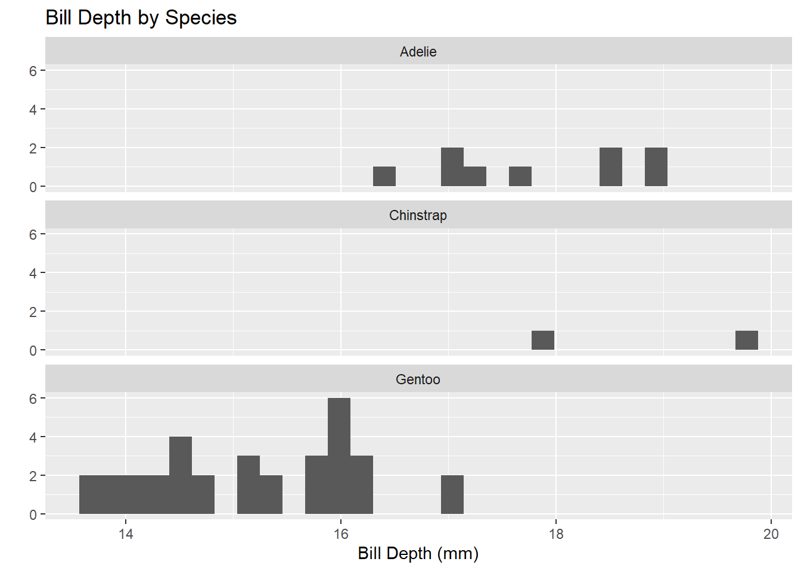

## Palmer Penguins

The Palmer Penguins data set is one of the most common resources for data analysis and visualization with complex observations from three species: Adélie, Chinstrap, and Gentoo. The penguins live on different islands in the Palmer Archipelago near Antarctica. In this data set, there is information about the species, island location, bill length and depth, flipper length, body mass, and sex. Therefore, it is also an easy, ecologically more relevant analog of the classical Iris data set and a real example to conduct statistical analyses, machine learning, and data visualization in R and Python. It is highly accessible to researchers and instructors for teaching applied explorations in biological data.


::: {.cell}

```{.r .cell-code}
#Load the tidyverse
library(tidyverse)
```

::: {.cell-output .cell-output-stderr}

```
── Attaching core tidyverse packages ──────────────────────── tidyverse 2.0.0 ──
✔ dplyr     1.1.4     ✔ readr     2.1.5
✔ forcats   1.0.0     ✔ stringr   1.5.1
✔ ggplot2   3.5.1     ✔ tibble    3.2.1
✔ lubridate 1.9.4     ✔ tidyr     1.3.1
✔ purrr     1.0.2     
── Conflicts ────────────────────────────────────────── tidyverse_conflicts() ──
✖ dplyr::filter() masks stats::filter()
✖ dplyr::lag()    masks stats::lag()
ℹ Use the conflicted package (<http://conflicted.r-lib.org/>) to force all conflicts to become errors
```


:::

```{.r .cell-code}
#Read the penguins_samp1 data file from github
penguins <- read_csv("https://raw.githubusercontent.com/mcduryea/Intro-to-Bioinformatics/main/data/penguins_samp1.csv")
```

::: {.cell-output .cell-output-stderr}

```
Rows: 44 Columns: 8
── Column specification ────────────────────────────────────────────────────────
Delimiter: ","
chr (3): species, island, sex
dbl (5): bill_length_mm, bill_depth_mm, flipper_length_mm, body_mass_g, year

ℹ Use `spec()` to retrieve the full column specification for this data.
ℹ Specify the column types or set `show_col_types = FALSE` to quiet this message.
```


:::

```{.r .cell-code}
#See the first six rows of the data we've read in to our notebook
penguins %>% head()
```

::: {.cell-output .cell-output-stdout}

```
# A tibble: 6 × 8
  species island bill_length_mm bill_depth_mm flipper_length_mm body_mass_g
  <chr>   <chr>           <dbl>         <dbl>             <dbl>       <dbl>
1 Gentoo  Biscoe           59.6          17                 230        6050
2 Gentoo  Biscoe           48.6          16                 230        5800
3 Gentoo  Biscoe           52.1          17                 230        5550
4 Gentoo  Biscoe           51.5          16.3               230        5500
5 Gentoo  Biscoe           55.1          16                 230        5850
6 Gentoo  Biscoe           49.8          15.9               229        5950
# ℹ 2 more variables: sex <chr>, year <dbl>
```


:::
:::


The following is a table of six rows and eight columns of measurements of Gentoo penguins from Biscoe Island across different years. The variables include species, island, and numeric measurements such as bill length, in mm, bill depth, in mm, flipper length, in mm, and body mass in grams. It contains the sex of the penguins, and they are all males; the year of observation is from 2007 to 2009. From the measures of penguins, the flipper lengths are approximately 230 mm for all, and also, bill dimension and body masses all show very close variations from one another, meaning there are no atypical records in this sample population regarding physical measurements.

## Data Manipulation **and Summarization**

In this section of the analysis, we aim to learn how to use R coding to manipulate data. We will be focusing on how to filter rows, subset columns, group data, and compute summary statistics.


::: {.cell}

```{.r .cell-code}
penguins %>%
  count(species)
```

::: {.cell-output .cell-output-stdout}

```
# A tibble: 3 × 2
  species       n
  <chr>     <int>
1 Adelie        9
2 Chinstrap     2
3 Gentoo       33
```


:::
:::


The result is the count of penguin species in the dataset grouped by their names: Adelie has 9 members, Chinstrap has 2, and Gentoo has 33; Gentoo is the most abundant species within the dataset. That would, therefore, mean the dataset is not well distributed among the species since there is strong representation from Gentoo penguins compared to the other two species.


::: {.cell}

```{.r .cell-code}
penguins %>% 
  count(island, species)
```

::: {.cell-output .cell-output-stdout}

```
# A tibble: 5 × 3
  island    species       n
  <chr>     <chr>     <int>
1 Biscoe    Adelie        3
2 Biscoe    Gentoo       33
3 Dream     Adelie        1
4 Dream     Chinstrap     2
5 Torgersen Adelie        5
```


:::
:::


The output gives a summary of the number of penguins of each species counted on different islands. The Gentoo species is most abundant and has been observed 33 times on Biscoe Island, whereas the Adelie species is represented on all three islands, with the highest number of 5 on Torgersen Island. The Chinstrap species is the least represented, with a total of only 2 observed on the Dream Island.


::: {.cell}

```{.r .cell-code}
penguins %>%
  count(island, species) %>%
  pivot_wider(names_from = species, values_from = n, values_fill = 0)
```

::: {.cell-output .cell-output-stdout}

```
# A tibble: 3 × 4
  island    Adelie Gentoo Chinstrap
  <chr>      <int>  <int>     <int>
1 Biscoe         3     33         0
2 Dream          1      0         2
3 Torgersen      5      0         0
```


:::
:::


This output summarizes the data by reorganizing the counts of species per island into a wider format. The count () function counts the number of penguins for each species on each island. The privot_wider() reshapes the data. Finally, the missing values are placed with 0 using values_fill= 0 to make clear that no Gentoo or Chinstrap penguins were observed on Torgersen Island, and no Gentoo penguins were found on Dream Island.


::: {.cell}

```{.r .cell-code}
library("kableExtra")
```

::: {.cell-output .cell-output-stderr}

```

Attaching package: 'kableExtra'
```


:::

::: {.cell-output .cell-output-stderr}

```
The following object is masked from 'package:dplyr':

    group_rows
```


:::

```{.r .cell-code}
penguins %>%
  count(island, species) %>%
  pivot_wider(names_from = species, values_from = n, values_fill = 0) %>%
  kable() %>%
  kable_styling(bootstrap_options = c("hover", "striped"))
```

::: {.cell-output-display}

`````{=html}
<table class="table table-hover table-striped" style="margin-left: auto; margin-right: auto;">
 <thead>
  <tr>
   <th style="text-align:left;"> island </th>
   <th style="text-align:right;"> Adelie </th>
   <th style="text-align:right;"> Gentoo </th>
   <th style="text-align:right;"> Chinstrap </th>
  </tr>
 </thead>
<tbody>
  <tr>
   <td style="text-align:left;"> Biscoe </td>
   <td style="text-align:right;"> 3 </td>
   <td style="text-align:right;"> 33 </td>
   <td style="text-align:right;"> 0 </td>
  </tr>
  <tr>
   <td style="text-align:left;"> Dream </td>
   <td style="text-align:right;"> 1 </td>
   <td style="text-align:right;"> 0 </td>
   <td style="text-align:right;"> 2 </td>
  </tr>
  <tr>
   <td style="text-align:left;"> Torgersen </td>
   <td style="text-align:right;"> 5 </td>
   <td style="text-align:right;"> 0 </td>
   <td style="text-align:right;"> 0 </td>
  </tr>
</tbody>
</table>

`````

:::
:::


KableExtra will count the penguin species on each island, reshape the data so that species are columns and the count is what is shown, fill in missing values with 0, and output this as a styled table with hover and striped effects for readability. This makes it visually appealing and interpretable.


::: {.cell}

```{.r .cell-code}
penguins %>%
  summarize(
    min_bill_length = min(bill_length_mm, na.rm = TRUE),
    first_quartile_bill_length = quantile(bill_length_mm, 0.25, na.rm = TRUE),
    median_bill_length = median(bill_length_mm, na.rm = TRUE),
    mean_bill_length_mm = mean(bill_length_mm, na.rm = TRUE),
    third_quartile_bill_length = quantile(bill_length_mm, 0.75, na.rm = TRUE),
    standard_deviation_bill_length = sd(bill_length_mm, na.rm = TRUE)
    ) %>%
  pivot_longer(cols = everything())
```

::: {.cell-output .cell-output-stdout}

```
# A tibble: 6 × 2
  name                           value
  <chr>                          <dbl>
1 min_bill_length                36.2 
2 first_quartile_bill_length     44.6 
3 median_bill_length             46.4 
4 mean_bill_length_mm            46.4 
5 third_quartile_bill_length     49.1 
6 standard_deviation_bill_length  4.93
```


:::
:::


The code gives the minimum, first quartile, median, mean, third quartile, and standard deviation of the variable bill_length_mm in the penguin's data set, not taking into account any missing values. This summary is reshaped into a longer format using the pivot_longer command in which each statistic gets to be a separate row with its value for easier viewing or analysis.

### **Selecting Specific Columns and Rows**

In this section of the analysis, we aim to select specific columns or rows satisfying certain conditions (using the filter() function).


::: {.cell}

```{.r .cell-code}
penguins %>%
  select(species, island, sex, year)
```

::: {.cell-output .cell-output-stdout}

```
# A tibble: 44 × 4
   species island sex    year
   <chr>   <chr>  <chr> <dbl>
 1 Gentoo  Biscoe male   2007
 2 Gentoo  Biscoe male   2008
 3 Gentoo  Biscoe male   2009
 4 Gentoo  Biscoe male   2009
 5 Gentoo  Biscoe male   2009
 6 Gentoo  Biscoe male   2009
 7 Gentoo  Biscoe male   2008
 8 Gentoo  Biscoe male   2009
 9 Gentoo  Biscoe male   2008
10 Gentoo  Biscoe male   2007
# ℹ 34 more rows
```


:::
:::


The code select (), selects the columns species, island, sex, and year from the penguin's data set. It then displays the species, island, sex, and year of each penguin observation.


::: {.cell}

```{.r .cell-code}
penguins %>%
  select(species, island, sex, year) %>%
  filter(species == "Chinstrap")
```

::: {.cell-output .cell-output-stdout}

```
# A tibble: 2 × 4
  species   island sex     year
  <chr>     <chr>  <chr>  <dbl>
1 Chinstrap Dream  male    2009
2 Chinstrap Dream  female  2007
```


:::
:::


The code select (), selects the columns species, island, sex, and year from the penguin's data set, then the code filter(), filters the rows to have only those where the species is "Chinstrap." The resulting tibble contains 2 rows, showing the gender and year of observation for Chinstrap penguins from Dream Island in 2007 and 2009.


::: {.cell}

```{.r .cell-code}
chinstraps <- penguins %>%
  select(species, island, sex, year) %>%
  filter(species == "Chinstrap") %>%
  select(-species)

chinstraps %>%
  head()
```

::: {.cell-output .cell-output-stdout}

```
# A tibble: 2 × 3
  island sex     year
  <chr>  <chr>  <dbl>
1 Dream  male    2009
2 Dream  female  2007
```


:::
:::


This code will create a new data frame called Chinstraps that selects the columns species, island, sex, and year from the penguin data frame, filters the rows where the species is "Chinstrap," and then drops the species column. The function head() has been used to show the first 2 rows of this modified data frame, which displays the island, sex, and year of the Chinstrap penguins.

## **Grouping and Summarizing Groups**

In this section of the analysis, we aim to use the codes group_by() and summarize() to compare summary statistics across groups.


::: {.cell}

```{.r .cell-code}
penguins %>%
  group_by(species) %>%
  summarise(
    mean_bill_depth_mm = mean(bill_depth_mm, na.rm = TRUE),
    sd_bill_depth_mm = sd(bill_depth_mm, na.rm = TRUE)
  )
```

::: {.cell-output .cell-output-stdout}

```
# A tibble: 3 × 3
  species   mean_bill_depth_mm sd_bill_depth_mm
  <chr>                  <dbl>            <dbl>
1 Adelie                  17.8            0.935
2 Chinstrap               18.8            1.41 
3 Gentoo                  15.2            0.951
```


:::
:::


Bill depth differs among species; the mean bill depth was largest for the Chinstrap species, followed by Adelie and Gentoo species. Chinstrap penguins have the largest standard deviation among the three groups, indicating more variation in bill depth measurements within that group.

### **Data Visualization with `ggplot()`**

In this section of the analysis, we aim to learn how to code with ggplot() to create data visualization for categorical and numerical variables.

## One categorical variable is visualized with a bar plot.


::: {.cell}

```{.r .cell-code}
penguins %>%
  ggplot() +
  geom_bar(mapping = aes(x = species)) +
  labs(title ="Counts of Penguin Species",
       x = "Species", y = "Count")
```

::: {.cell-output-display}
{width=672}
:::
:::


This bar chart plotted by the code visualizes counts from each penguin species represented in the overall data set. In this plot, the x-axis represents the various species, and the y-axis represents the count of penguins that fall into each category of species. We can also identify visually that the Gentoo penguins have the highest count and are followed by Adelie and Chinstrap penguins, respectively. The pattern of species distribution in this data set is automatically told by a visual representation.

In ggplot(), the + signs are used to add layers to the plot. Each layer becomes a different part of the plot like the type, geom_bar(), labels, labs(), and any data transformations. The + allows us, in a way, to modularly build up a plot by sequentially adding layers, which increases flexibility and readability in the code.


::: {.cell}

```{.r .cell-code}
penguins %>%
  ggplot() +
  geom_bar(mapping = aes(x = island)) +
  labs(title = "Counts of Penguins by Island",
       x = "Island", y = "Count")
```

::: {.cell-output-display}
{width=672}
:::
:::


This plot shows the distribution of penguins across the different islands in the data set. The x-axis represents the islands, while the y-axis represents how many penguins come from each island. According to the plot, Biscoe Island hosts the highest number of penguins, followed by Dream Island, whereas Torgersen Island has the least. From this, we understand to which island the majority of penguins in this data set belong.

## One numerical variable is visualized with a histogram


::: {.cell}

```{.r .cell-code}
penguins %>%
  ggplot() +
  geom_histogram(mapping = aes(x = bill_length_mm),
                 color = "white",
                 fill = "blue") +
  labs(title ="Distribution of Bill Lengths",
       x = "Bill Length (mm)", y = "Count")
```

::: {.cell-output .cell-output-stderr}

```
`stat_bin()` using `bins = 30`. Pick better value with `binwidth`.
```


:::

::: {.cell-output-display}
{width=672}
:::
:::


This code visualizes the distribution in the bill length of the penguins in this data set. It is a histogram showing on the x-axis, length in millimeters, and y-axis, the frequency of the penguins in that bill length. It provides a clear picture of how the bill lengths are distributed and what length is more frequent in this particular data set.


::: {.cell}

```{.r .cell-code}
penguins %>%
  ggplot() +
  geom_density(mapping = aes(x = bill_length_mm), fill = "blue") +
  labs(title = "Density Plot of Bill Lengths",
       x = "Bill Length (mm)", y = "Density")
```

::: {.cell-output-display}
{width=672}
:::
:::


The density plot gives a better impression of the general shape of the distribution (symmetrical or asymmetrical) and results in a smooth appearance without giving too much emphasis to bin boundaries. On the other hand, The histogram is better at showing the exact frequency of bill lengths within specific ranges, making it easy to see how many penguins fall into each bin.

## The relationship between two numerical variables can be explored with a scatter plot


::: {.cell}

```{.r .cell-code}
penguins %>%
  ggplot() +
  geom_point(mapping = aes(x = bill_depth_mm, y = bill_length_mm)) +
  labs(title = "Bill Depth and Length",
       x = "Bill Depth (mm)",
       y = "Bill Length (mm)")
```

::: {.cell-output-display}
{width=672}
:::
:::


There is a positive relationship in the scatter plot between bill depth and bill length, as the bill length generally increases as bill depth increases, suggesting that penguins with deeper bills have longer bills. The data points spread across both axes, showing the variability of bill length for penguins of similar bill depths. While there are no clear clusters in this plot, the relationship is rather continuous; however, there could be outliers or hidden patterns in some subsets that might further be investigated to identify those unusual penguins with atypical bill proportions.


::: {.cell}

```{.r .cell-code}
penguins %>% 
  ggplot() + 
  geom_point(mapping = aes(x = flipper_length_mm, y = body_mass_g)) + 
  labs(title = "Flipper Length and Body Mass",
       x = "Flipper Length (mm)", 
       y = "Body Mass (g)")
```

::: {.cell-output-display}
{width=672}
:::
:::


We can observe a positive relationship between flipper length and body mass in the scatter plot, since the longer the flipper, the larger the body mass is likely to be. From the plot, we can see a strong and consistent relationship. This helps us to understand how much body mass is related to flipper length and what other factors cause variations in penguin size.

## The associations between two categorical variables can be explored using bar plots and fill


::: {.cell}

```{.r .cell-code}
penguins %>%
  ggplot() +
  geom_bar(mapping = aes(x = island, fill = species)) +
  labs(title = "Species by Island",
       x = "Island",
       y = "Species")
```

::: {.cell-output-display}
{width=672}
:::
:::


The bar plot gives the distribution of penguin species on each of the three islands. Each of the bars represents the number of penguins of the specific color in the corresponding island. From the plot, we notice that Biscoe Island hosts more penguins compared to Dream and Torgersen Islands. Moreover, the plot indicates that every island has species differentials; even though the three islands share species abundance, including the Adelie and Gentoo penguins, being highly abundant on all three islands, whereas on Dream Island, Chinstrap penguins occur. The geospatial display depicts variation in the penguin population according to islands.

## One numerical and one categorical variable can be compared using side-by-side plots, or faceted plots


::: {.cell}

```{.r .cell-code}
penguins %>%
  ggplot() +
  geom_boxplot(mapping = aes(x = bill_depth_mm, y = species)) +
  labs(title = "Bill Depth by Species",
       x = "Bill Depth (mm)",
       y = "")
```

::: {.cell-output-display}
{width=672}
:::
:::


The boxplot shows the distribution of bill depth in millimeters for three species of penguins. For the Gentoo penguins, the bill depths range is from about 13.5 mm to 17mm, with a median of about 15.3 mm. The variability of bill depths of the Chinstrap penguin has a narrower range, encompassing most of the measurements around a median of about 18.7 mm. The Adelie penguin has a narrow range, and a median bill depth of about 17.6 mm. Overall, this plot shows large differences in bill depth between species, which may imply that bill depth is one of the most important morphological characteristics for these species' differentiation.


::: {.cell}

```{.r .cell-code}
penguins %>%
  ggplot() +
  geom_histogram(mapping = aes(x = bill_depth_mm)) +
  facet_wrap(~species, ncol = 1) +
  labs(title = "Bill Depth by Species",
       x = "Bill Depth (mm)",
       y = "")
```

::: {.cell-output .cell-output-stderr}

```
`stat_bin()` using `bins = 30`. Pick better value with `binwidth`.
```


:::

::: {.cell-output-display}
{width=672}
:::
:::


The histogram shows a distinct pattern with regard to the bill depth: the Adelie penguin is concentrated at about 17 mm, representing minimal variability in its bill depth, while the data for the Chinstrap penguins is quite sparse with measurements scattered from 17 to 20 mm making any analytical overview of the trend very hard. The most variable are Gentoo penguins with bill depths mostly between 14 and 17mm, peaking at about 16mm, which suggests a possible greater variability than the other species. From the following plot, there are species -specific differences in bill depth, and data for Adelie and Gentoo penguins is much more abundant than that for the Chinstrap penguins.

## Advanced Plotting

In this part of the analysis we aim to learn how to build more complex plots. plots.


::: {.cell}

```{.r .cell-code}
penguins %>%
  filter(!is.na(sex)) %>%
  ggplot() +
  geom_point(mapping = aes(x = bill_length_mm, 
                           y = flipper_length_mm,
                           color = species,
                           shape = sex)) +
  geom_smooth(mapping = aes(x = bill_length_mm,
                            y = flipper_length_mm,
                            color = species),
              method = "lm") +
  facet_grid(island ~ sex, scales = "free") +
  labs(title = "Flipper and Bill Lengths by Species and Sex",
       x = "Bill Length (mm)",
       y = "Flipper Length(mm)") +
  theme_light()
```

::: {.cell-output .cell-output-stderr}

```
`geom_smooth()` using formula = 'y ~ x'
```


:::

::: {.cell-output .cell-output-stderr}

```
Warning in qt((1 - level)/2, df): NaNs produced
Warning in qt((1 - level)/2, df): NaNs produced
```


:::

::: {.cell-output .cell-output-stderr}

```
Warning in max(ids, na.rm = TRUE): no non-missing arguments to max; returning
-Inf
Warning in max(ids, na.rm = TRUE): no non-missing arguments to max; returning
-Inf
```


:::

::: {.cell-output-display}
{width=672}
:::
:::


The plot shows the relationship between penguin bill length and flipper length, categorised by species and sex across islands. Each panel corresponds to a specific island-sex combination because of the facet_grid(island \~ sex, scales = "free") code for variable comparisons. The geom_point function adds colored data points by species and sex, while geom_smooth adds species regression lines. In the case of Gentoo penguins on Biscoe Island, there is a strong positive correlation between bill and flipper lengths, especially for males, as can be seen from the steep regression line. Other species, such as Adelie, have sparse data points and inconsistent trends across different islands. The use of theme_light ensures a clean aesthetic, while the custom labs provides meaningful labels for the axes and title. In general, this code has been very effective at showing interspecies and interisland differences in penguin morphology.


::: {.cell}

```{.r .cell-code}
penguins %>%
  filter(!is.na(sex)) %>%
  ggplot() +
  geom_point(mapping = aes(x = bill_depth_mm, 
                           y = body_mass_g,
                           color = species,
                           shape = sex)) +
  geom_smooth(mapping = aes(x = bill_depth_mm,
                            y = body_mass_g,
                            color = species),
              method = "lm") +
  facet_grid(island ~ sex, scales = "free") +
  labs(title = "Body Mass and Bill Depth by Species and Sex",
       x = "Bill Depth (mm)",
       y = "Body Mass (g)") +
  theme_light()
```

::: {.cell-output .cell-output-stderr}

```
`geom_smooth()` using formula = 'y ~ x'
```


:::

::: {.cell-output .cell-output-stderr}

```
Warning in qt((1 - level)/2, df): NaNs produced
Warning in qt((1 - level)/2, df): NaNs produced
```


:::

::: {.cell-output .cell-output-stderr}

```
Warning in max(ids, na.rm = TRUE): no non-missing arguments to max; returning
-Inf
Warning in max(ids, na.rm = TRUE): no non-missing arguments to max; returning
-Inf
```


:::

::: {.cell-output-display}
{width=672}
:::
:::


This code will plot body mass against bill depth, with points differentiated by species (color) and sex (shape). It also adds a linear model trend line using (lm) for each species and facets the data by island and sex. Since facet_grid uses scales = "free", the scales will adjust independently for each facet to fit the data range.

## A Final Question


::: {.cell}

```{.r .cell-code}
# Check for NA values and ensure data is clean
clean_penguins <- penguins %>%
  filter(!is.na(bill_length_mm))

# Calculate the overall mean bill length
mean_bill_length <- mean(clean_penguins$bill_length_mm)

# Perform a one-sample t-test for the entire population
t_test_population <- t.test(clean_penguins$bill_length_mm, 
                             mu = 45, 
                             alternative = "greater")

# View the results
mean_bill_length
```

::: {.cell-output .cell-output-stdout}

```
[1] 46.37045
```


:::

```{.r .cell-code}
t_test_population
```

::: {.cell-output .cell-output-stdout}

```

	One Sample t-test

data:  clean_penguins$bill_length_mm
t = 1.8438, df = 43, p-value = 0.03606
alternative hypothesis: true mean is greater than 45
95 percent confidence interval:
 45.12094      Inf
sample estimates:
mean of x 
 46.37045 
```


:::

```{.r .cell-code}
# Subset analysis (example: Adelie species)
adelie_penguins <- clean_penguins %>%
  filter(species == "Adelie")

mean_bill_length_adelie <- mean(adelie_penguins$bill_length_mm)

t_test_adelie <- t.test(adelie_penguins$bill_length_mm, 
                        mu = 45, 
                        alternative = "greater")

# View the subset results
mean_bill_length_adelie
```

::: {.cell-output .cell-output-stdout}

```
[1] 39.12222
```


:::

```{.r .cell-code}
t_test_adelie
```

::: {.cell-output .cell-output-stdout}

```

	One Sample t-test

data:  adelie_penguins$bill_length_mm
t = -8.5666, df = 8, p-value = 1
alternative hypothesis: true mean is greater than 45
95 percent confidence interval:
 37.84633      Inf
sample estimates:
mean of x 
 39.12222 
```


:::
:::


The penguins' data set could be used to test if the average bill length is greater than 45 mm using statistical testing. One-sample t-test could be performed to test if the overall mean bill length is significantly higher than 45 mm. This same testing could be done on subsets, such as for species or islands, by filtering the data and re-testing. It would be very strong evidence that the mean bill length is greater than 45 mm if the p-value is less than 0.05. For small subsets or very noisy data, the confidence will be lower either due to higher variability or smaller sample sizes.
