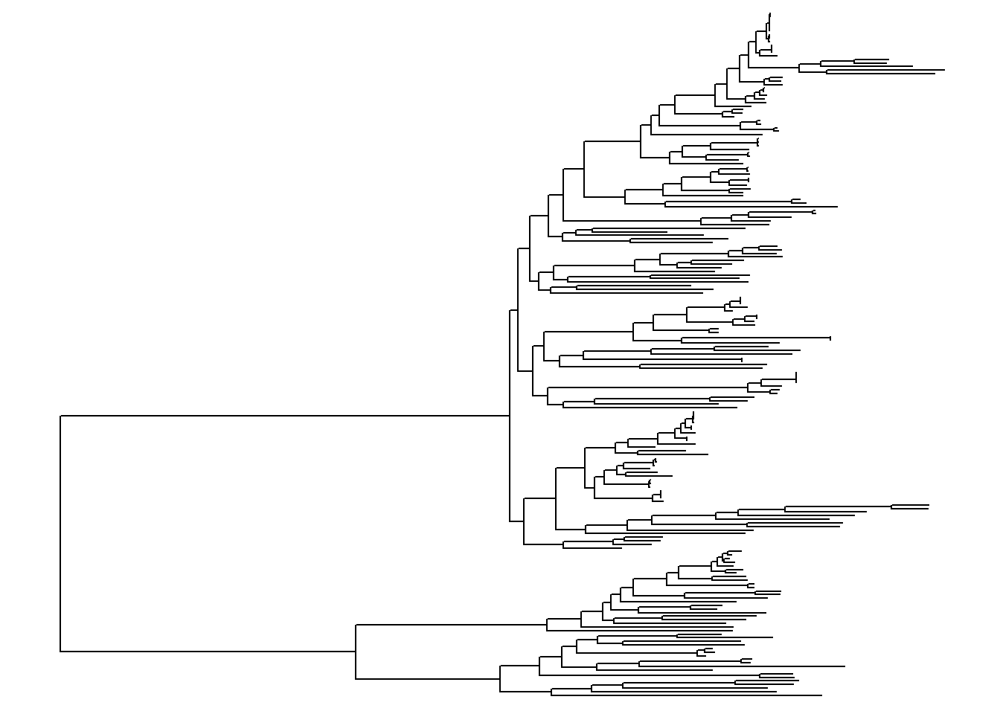
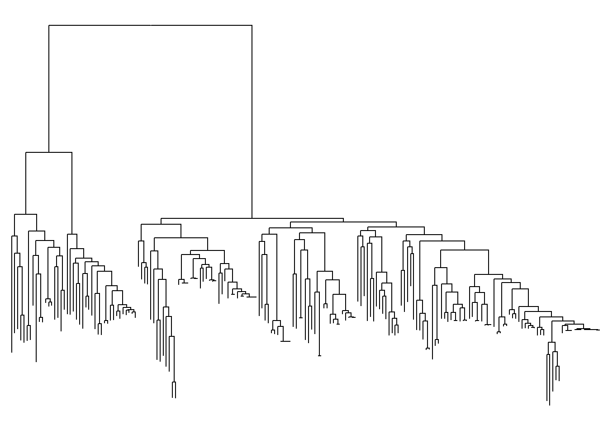
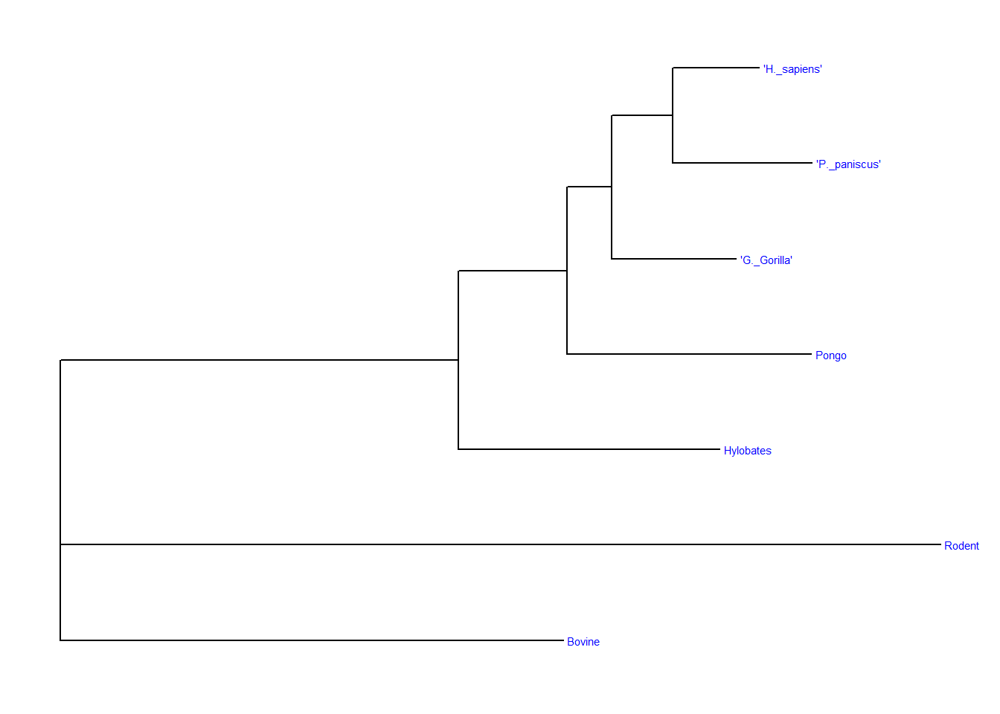
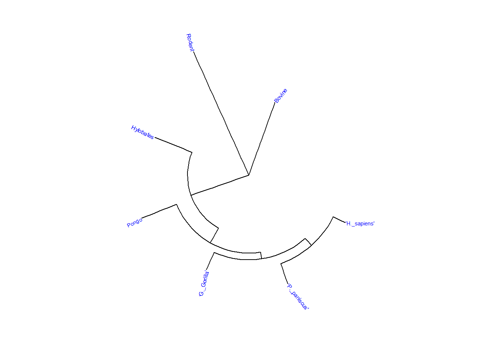

# Phylogenetic  Analysis and Visualization 

The following project will explore how to analyze genetic data to build and visualize evolutionary trees. This will help us to understand the relationship between species. Using R and bioinformatics packages like ape, treeio, and ggtree, we will work with different tree formats such as Newick, Nexus, BEAST, and RAxML, to load, convert and analyze phylogenetic data. Circular and unrooted trees will be created to make complex evolutionary relationships easier to understand. The following project, will help to develop essential skills in plylogenetic analysis, bioinformatics, and data visualization, gaining a deeper appreciation for how genetic relationships are studied in Biology.

### Setting Up the Required Packages 

Before analyzing evolutionary tress, the needed R packages must be installed. The following code ensures that the necessary bioinformatic packages such as ape, treeio, ggtree, and SGSeq are available. It will also install BiocManager, which is a tool for managing specialized bioinformatic packages.


::: {.cell}

```{.r .cell-code}
#install.packages("ape")

#if (!require("BiocManager", quietly = TRUE))
    #install.packages("BiocManager")

#BiocManager::install("treeio")

#if (!require("BiocManager", quietly = TRUE))
    #install.packages("BiocManager")

#BiocManager::install("ggtree")

#if (!require("BiocManager", quietly = TRUE))
    #install.packages("BiocManager")

#BiocManager::install("SGSeq")
```
:::


After running the code, all the required packages will be installed, allowing us to load and use them for phylogenetic analysis and tree visualization.

### Loading the Necessary Libraries 

The following code will load important libraries such as rbioinfcookbook, SGSeq, treeio, ggplot2, and ggtree. These libraries will help us to read, analyze and visualize phylogenetic trees using different formats and visualization styles.


::: {.cell}

```{.r .cell-code}
library(rbioinfcookbook)
library(SGSeq)
```

::: {.cell-output .cell-output-stderr}

```
Loading required package: IRanges
```


:::

::: {.cell-output .cell-output-stderr}

```
Loading required package: BiocGenerics
```


:::

::: {.cell-output .cell-output-stderr}

```

Attaching package: 'BiocGenerics'
```


:::

::: {.cell-output .cell-output-stderr}

```
The following objects are masked from 'package:stats':

    IQR, mad, sd, var, xtabs
```


:::

::: {.cell-output .cell-output-stderr}

```
The following objects are masked from 'package:base':

    anyDuplicated, aperm, append, as.data.frame, basename, cbind,
    colnames, dirname, do.call, duplicated, eval, evalq, Filter, Find,
    get, grep, grepl, intersect, is.unsorted, lapply, Map, mapply,
    match, mget, order, paste, pmax, pmax.int, pmin, pmin.int,
    Position, rank, rbind, Reduce, rownames, sapply, saveRDS, setdiff,
    table, tapply, union, unique, unsplit, which.max, which.min
```


:::

::: {.cell-output .cell-output-stderr}

```
Loading required package: S4Vectors
```


:::

::: {.cell-output .cell-output-stderr}

```
Loading required package: stats4
```


:::

::: {.cell-output .cell-output-stderr}

```

Attaching package: 'S4Vectors'
```


:::

::: {.cell-output .cell-output-stderr}

```
The following object is masked from 'package:utils':

    findMatches
```


:::

::: {.cell-output .cell-output-stderr}

```
The following objects are masked from 'package:base':

    expand.grid, I, unname
```


:::

::: {.cell-output .cell-output-stderr}

```

Attaching package: 'IRanges'
```


:::

::: {.cell-output .cell-output-stderr}

```
The following object is masked from 'package:grDevices':

    windows
```


:::

::: {.cell-output .cell-output-stderr}

```
Loading required package: GenomicRanges
```


:::

::: {.cell-output .cell-output-stderr}

```
Loading required package: GenomeInfoDb
```


:::

::: {.cell-output .cell-output-stderr}

```
Loading required package: Rsamtools
```


:::

::: {.cell-output .cell-output-stderr}

```
Loading required package: Biostrings
```


:::

::: {.cell-output .cell-output-stderr}

```
Loading required package: XVector
```


:::

::: {.cell-output .cell-output-stderr}

```

Attaching package: 'Biostrings'
```


:::

::: {.cell-output .cell-output-stderr}

```
The following object is masked from 'package:base':

    strsplit
```


:::

::: {.cell-output .cell-output-stderr}

```
Loading required package: SummarizedExperiment
```


:::

::: {.cell-output .cell-output-stderr}

```
Loading required package: MatrixGenerics
```


:::

::: {.cell-output .cell-output-stderr}

```
Loading required package: matrixStats
```


:::

::: {.cell-output .cell-output-stderr}

```
Warning: package 'matrixStats' was built under R version 4.4.3
```


:::

::: {.cell-output .cell-output-stderr}

```

Attaching package: 'MatrixGenerics'
```


:::

::: {.cell-output .cell-output-stderr}

```
The following objects are masked from 'package:matrixStats':

    colAlls, colAnyNAs, colAnys, colAvgsPerRowSet, colCollapse,
    colCounts, colCummaxs, colCummins, colCumprods, colCumsums,
    colDiffs, colIQRDiffs, colIQRs, colLogSumExps, colMadDiffs,
    colMads, colMaxs, colMeans2, colMedians, colMins, colOrderStats,
    colProds, colQuantiles, colRanges, colRanks, colSdDiffs, colSds,
    colSums2, colTabulates, colVarDiffs, colVars, colWeightedMads,
    colWeightedMeans, colWeightedMedians, colWeightedSds,
    colWeightedVars, rowAlls, rowAnyNAs, rowAnys, rowAvgsPerColSet,
    rowCollapse, rowCounts, rowCummaxs, rowCummins, rowCumprods,
    rowCumsums, rowDiffs, rowIQRDiffs, rowIQRs, rowLogSumExps,
    rowMadDiffs, rowMads, rowMaxs, rowMeans2, rowMedians, rowMins,
    rowOrderStats, rowProds, rowQuantiles, rowRanges, rowRanks,
    rowSdDiffs, rowSds, rowSums2, rowTabulates, rowVarDiffs, rowVars,
    rowWeightedMads, rowWeightedMeans, rowWeightedMedians,
    rowWeightedSds, rowWeightedVars
```


:::

::: {.cell-output .cell-output-stderr}

```
Loading required package: Biobase
```


:::

::: {.cell-output .cell-output-stderr}

```
Welcome to Bioconductor

    Vignettes contain introductory material; view with
    'browseVignettes()'. To cite Bioconductor, see
    'citation("Biobase")', and for packages 'citation("pkgname")'.
```


:::

::: {.cell-output .cell-output-stderr}

```

Attaching package: 'Biobase'
```


:::

::: {.cell-output .cell-output-stderr}

```
The following object is masked from 'package:MatrixGenerics':

    rowMedians
```


:::

::: {.cell-output .cell-output-stderr}

```
The following objects are masked from 'package:matrixStats':

    anyMissing, rowMedians
```


:::

```{.r .cell-code}
library(ape)
```

::: {.cell-output .cell-output-stderr}

```
Warning: package 'ape' was built under R version 4.4.3
```


:::

::: {.cell-output .cell-output-stderr}

```

Attaching package: 'ape'
```


:::

::: {.cell-output .cell-output-stderr}

```
The following object is masked from 'package:Biostrings':

    complement
```


:::

```{.r .cell-code}
library(treeio)
```

::: {.cell-output .cell-output-stderr}

```
treeio v1.30.0 Learn more at https://yulab-smu.top/contribution-tree-data/

Please cite:

LG Wang, TTY Lam, S Xu, Z Dai, L Zhou, T Feng, P Guo, CW Dunn, BR
Jones, T Bradley, H Zhu, Y Guan, Y Jiang, G Yu. treeio: an R package
for phylogenetic tree input and output with richly annotated and
associated data. Molecular Biology and Evolution. 2020, 37(2):599-603.
doi: 10.1093/molbev/msz240
```


:::

::: {.cell-output .cell-output-stderr}

```

Attaching package: 'treeio'
```


:::

::: {.cell-output .cell-output-stderr}

```
The following object is masked from 'package:Biostrings':

    mask
```


:::

```{.r .cell-code}
library(ggplot2)
```

::: {.cell-output .cell-output-stderr}

```

Attaching package: 'ggplot2'
```


:::

::: {.cell-output .cell-output-stderr}

```
The following object is masked from 'package:SGSeq':

    annotate
```


:::

```{.r .cell-code}
library(ggtree)
```

::: {.cell-output .cell-output-stderr}

```
ggtree v3.14.0 Learn more at https://yulab-smu.top/contribution-tree-data/

Please cite:

S Xu, Z Dai, P Guo, X Fu, S Liu, L Zhou, W Tang, T Feng, M Chen, L
Zhan, T Wu, E Hu, Y Jiang, X Bo, G Yu. ggtreeExtra: Compact
visualization of richly annotated phylogenetic data. Molecular Biology
and Evolution. 2021, 38(9):4039-4042. doi: 10.1093/molbev/msab166
```


:::

::: {.cell-output .cell-output-stderr}

```

Attaching package: 'ggtree'
```


:::

::: {.cell-output .cell-output-stderr}

```
The following object is masked from 'package:ape':

    rotate
```


:::

::: {.cell-output .cell-output-stderr}

```
The following object is masked from 'package:Biostrings':

    collapse
```


:::

::: {.cell-output .cell-output-stderr}

```
The following object is masked from 'package:IRanges':

    collapse
```


:::

::: {.cell-output .cell-output-stderr}

```
The following object is masked from 'package:S4Vectors':

    expand
```


:::
:::


After running the code, all the required tools to build and visualize evolutionary trees will be ready to use in R Studio, allowing us to move forward with our analysis.

### Reading Phylogenetic Tree Files 

The following code will load phylogenetic tree data from two different file formats like Newick and Nexus. The following code will first locate the files within the rbioinfcookbook package and then read them using the ape package.


::: {.cell}

```{.r .cell-code}
newick_file_path <- fs::path_package("extdata", "mammal_tree.nwk", package = "rbioinfcookbook" )

nexus_file_path <- fs::path_package("extdata", "mammal_tree.nexus", package = "rbioinfcookbook")

newick <- ape::read.tree(newick_file_path)
nexus <- ape::read.nexus(nexus_file_path)
```
:::


After running the code, two phylogenetic tress will be stored in R Studio. One from the Newick file and another from the Nexus file.

### Loading Phylogenetic Trees from BEAST and RAxML

The following code will retrieve and read two phylogenetic tree files generated by BEAST and RAxML. The BEAST file will contain a Maximum Clade Credibility tree, which is often used for Bayesian inference. On the other hand, the RAxML file will include bipartition branch labels, which provide confidence values for tree splits. Finally, the code will use the rbioinfcookbook package to locate the files and then reads them using the right functions.


::: {.cell}

```{.r .cell-code}
beast_file_path <- fs::path_package("extdata", "beast_mcc.tree", package = "rbioinfcookbook")

raxml_file_path <- fs::path_package("extdata", "RAxML_bipartitionsBranchLabels.H3", package = "rbioinfcookbook")

beast <- read.beast(beast_file_path)
raxml <- read.raxml(raxml_file_path)
```
:::


After running the code, two phylogenetic trees will be stored in R Studio. One from BEAST and another from RAxML. These trees can now be visualized to study evolutionary relationships.

### Checking the Data Type of the Newick Tree 

The following code will check what kind of object the newick tree is in R Studio. This command will help to confirm how R Studio recognizes and stores the newick object.


::: {.cell}

```{.r .cell-code}
class(newick)
```

::: {.cell-output .cell-output-stdout}

```
[1] "phylo"
```


:::
:::


After running the code, R Studio will return the class type of the newick object, which is the "phylo", meaning that it is stored as a phylogenetic tree that can be analyzed and visualized.

### Checking the Data Type of the Nexus Tree 

The following code will check how R recognizes and stores the nexus object, which contains a phylogenetic tree loaded from a NEXUS file. This code will help to confirm the structure of the tree data and ensure it has been correctly read into R Studio.


::: {.cell}

```{.r .cell-code}
class(nexus)
```

::: {.cell-output .cell-output-stdout}

```
[1] "phylo"
```


:::
:::


After running the code, R studio will return the class of the nexus object "phylo", indicating that it is stored as a phylogenetic tree structure.

### Checking the Data Type of the BEAST Tree 

The following code will check how R Studio recognizes and stores the beast object, which contains a phylogenetic tree generated using BEAST. This code will help to confirm that the tree was loaded correctly and is in the expected format for further analysis.


::: {.cell}

```{.r .cell-code}
class(beast)
```

::: {.cell-output .cell-output-stdout}

```
[1] "treedata"
attr(,"package")
[1] "tidytree"
```


:::
:::


After running the code R Studio will return the class of the beast object "treedata", indicating that it includes both the tree structure and additional metadata, such as branch lengths and posterior probabilities.

### Checking the Data Type of the RAxML Tree 

The following code checks how R Studio recognizes and stores the raxml object, which contains a phylogenetic tree generated using RAxML. This code will confirm that the tree has been properly loaded and is in the right format for further analysis.


::: {.cell}

```{.r .cell-code}
class(raxml)
```

::: {.cell-output .cell-output-stdout}

```
[1] "treedata"
attr(,"package")
[1] "tidytree"
```


:::
:::


After running the code, R Studio will return the class of the raxml object "treedata", meaning it includes both the tree structure and additional evolutionary information, such as branch support values.

### Converting Tree Formats for Analysis

The following code will convert the phylogenetic trees into different formats to make them easier to analyze and visualize. The beast tree will be transformed into a standard phylogenetic tree format (phylo), which makes easier working with tree structures. On the other hand, the newick tree will be converted into a treedata object, which contains additional metadata that is useful for advanced analyses and visualizations.


::: {.cell}

```{.r .cell-code}
beast_phylo <- treeio::as.phylo(beast)
newick_tidytree <- treeio::as.treedata(newick)
```
:::


After running the code, the beast_phylo will be in a simpler phylo format, which will allow to manipulate the phylogenetic tree. On the other hand, the newick_tidytree will be in the treedata format, which will allow enhaced visualization and data integration.

### Saving Phylogenetic Trees in Different Formats 

The following code will export phylogenetic trees into two widely used file formats. The newick_tidytree is saved as a BEAST. On the other hand, the beast_phylo tree is saved in the Nexus format, which supports additional annotations.


::: {.cell}

```{.r .cell-code}
treeio::write.beast(newick_tidytree, file = "mammal_tree.beast")
ape::write.nexus(beast_phylo, file = "beast_mcc.nexus")
```
:::


After running the code, the BEAST format file named "mammal_tree.beast" is created from the newick_tidytree. On the other hand, the Nexus format file named "beast_mcc.nexus" is generated from the beast_phylo.

### Loading a Phylogenetic Tree from a File

The following code will load a phylogenetic tree stored in a Newick format file named "itol.nwk". The fs::path_package() function will help to locate the file within the rbioinfcookbook package. The ape::read.tree() function reads and stores the tree structure in R Studio.


::: {.cell}

```{.r .cell-code}
tree_file <- fs::path_package("extdata", "itol.nwk", package = "rbioinfcookbook")

itol<- ape::read.tree(tree_file)
```
:::


After running the code, the variable itol will contain the phylogenetic tree data from the "itol.nwk" file.

### Visualizing the Phylogenetic Tree 

The following code will generate a graphical representation of the phylogenetic tree stored in the itol variable. The ggtree() function from the ggtree package takes the tree data and creates a visualization, making it easier to interpret evolutionary relationships between species.


::: {.cell}

```{.r .cell-code}
ggtree(itol)
```

::: {.cell-output-display}
{width=672}
:::
:::


After running the code, the outcome is a plotted phylogenetic tree showing the branching structure of the loaded tree data.

### Adding Labels to the Phylogenetic Tree 

The following code enhances the visualization of the phylogenetic tree by adding labels to the end points of the tree. The geom_tiplab() function will display the names of the species, and the labels are colored blue and sized 1 for a "better" visualization.


::: {.cell}

```{.r .cell-code}
ggtree(itol) +
  geom_tiplab(color = "blue", size = 1)
```

::: {.cell-output-display}
{width=672}
:::
:::


The outcome is a phylogenetic tree with blue labels at the end of the tree, making it easier to identify the species or samples at each branching point.

### Visualizing the Phylogenetic Tree in a Circular Layout

The following code will take the previously created phylogenetic tree and display it in a circular layout, which arranges the tree in a circular shape rather than in a linear form. In addition to this, the geom_tiplab() will add labels at the ends of the tree, with the labels colored blue and the font size set to 2 for "better" visualization.


::: {.cell}

```{.r .cell-code}
ggtree(itol, layout = "circular") +
  geom_tiplab(color = "blue", size = 2)
```

::: {.cell-output-display}
{width=672}
:::
:::


The outcome is a phylogenetic tree displayed in a circular format, making it easier to visualize the relationships between species.

### Customizing the Circular Phylogenetic Tree with Tip Labels and Highlighted Strips

The function geom_strip() will modify the circular phylogenetic tree by highlighting branches 13 and 14 with red color and a bar size of 1. The labels at the end of the tree will remain blue and with a font size of 2.


::: {.cell}

```{.r .cell-code}
ggtree(itol, layout = "circular") +
  geom_tiplab(color = "blue", size = 2) +
  geom_strip(13, 14, color = "red", barsize = 1)
```

::: {.cell-output-display}
{width=672}
:::
:::


The outcome is a phylogenetic tree in a circular layout, with the labels at the end of the tree visible in blue. In addition to this, branches 13 and 14 are visually emphasized using red strips, making it "easier" to focus on these parts of the tree for further analysis.

### Flipping and Reversing the Axes of the Phylogenetic Tree 

The following code will modify the phylogenetic tree by flipping the tree layout horizontally using the coord_flip() function and reversing the x-axis with the function scale_x_reverse(). This code will change the orientation of the tree for better visualization.


::: {.cell}

```{.r .cell-code}
ggtree(itol) +
  coord_flip() +
  scale_x_reverse()
```

::: {.cell-output-display}
{width=672}
:::
:::


The outcome is a flipped phylogenetic tree. The branches appear on the opposite side, and the x-axis is reversed, changing the direction of the tree. This helps to visualize the tree from a different perspective.

### Displaying the Phylogenetic Tree in an Unrooted Layout 

The following code will show the phylogenetic tree using the unrooted layout. The unrooted tree will not show a single ancestor at the base, which is useful to show the relationships between taxa without implying a specific evolutionary direction.


::: {.cell}

```{.r .cell-code}
ggtree(itol, layout = "unrooted")
```

::: {.cell-output .cell-output-stderr}

```
"daylight" method was used as default layout for unrooted tree.
```


:::

::: {.cell-output .cell-output-stderr}

```
Average angle change [1] 0.174910612627282
```


:::

::: {.cell-output .cell-output-stderr}

```
Average angle change [2] 0.161645191380673
```


:::

::: {.cell-output .cell-output-stderr}

```
Average angle change [3] 0.129304375923319
```


:::

::: {.cell-output .cell-output-stderr}

```
Average angle change [4] 0.0825706767962636
```


:::

::: {.cell-output .cell-output-stderr}

```
Average angle change [5] 0.100056259084497
```


:::

::: {.cell-output-display}
{width=672}
:::
:::


The outcome is a tree without a central root, which makes it easier to visualize the relationships among species where the root is not defined . This layout helps to focus on the structure of the tree rather than evolutionary path from a common ancestor.

### Reading a Mammal Phylogenetic Tree from a Newick File 

The following code will load a phylogenetic tree of mammals from a Newick file using the ape package. The read.tree function is used to import the tree data into R Studio.


::: {.cell}

```{.r .cell-code}
mammal_file <- fs::path_package("extdata", "mammal_tree.nwk", package = "rbioinfcookbook" )

mammal<- ape::read.tree(mammal_file)
```
:::


After running the code, the mammal phylogenetic tree will be successfully read and stored as an R object, allowing for further visualization of the tree structure.

### Visualizing a Mammal Phylogenetic Tree with Tip Labels 

The following code uses the ggtree package to visualize the phylogenetic tree of mammals, with blue colored tip labels that are sized 2. The tree previously read from a Newick file, will be displayed with labels at each tip of the tree, making it easier to identify the species in the tree.


::: {.cell}

```{.r .cell-code}
ggtree(mammal) +
  geom_tiplab(color = "blue", size = 2)
```

::: {.cell-output-display}
{width=672}
:::
:::


The outcome is a phylogenetic tree displayed with blue tip labels. The labels are visible at the end of each branch, helping to identify the species in the tree, helping to interpret the evolutionary relationships.

### Visualizing a Circular Mammal Phylogenetic Tree with Tip Labels 

The following code visualizes the phylogenetic tree of mammals in a circular layout using the ggtree package. The tip labels, which represent species, are color blue and have a size of 2, making the labels easy to read.


::: {.cell}

```{.r .cell-code}
ggtree(mammal, layout = "circular") +
  geom_tiplab(color = "blue", size = 2)
```

::: {.cell-output-display}
{width=672}
:::
:::


The output is a mammal phylogenetic tree displayed in a circular format, with blue tip labels. The circular layout increases the visual appeal of the tree, while the labeled tips provide clarity on the species in the tree. This layout helps to highlight the evolutionary relationships in a more organized manner.
